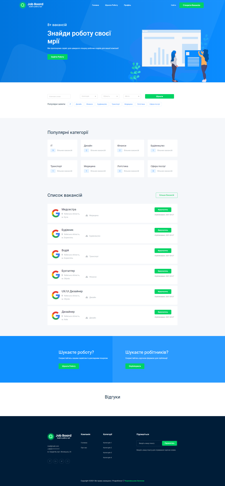
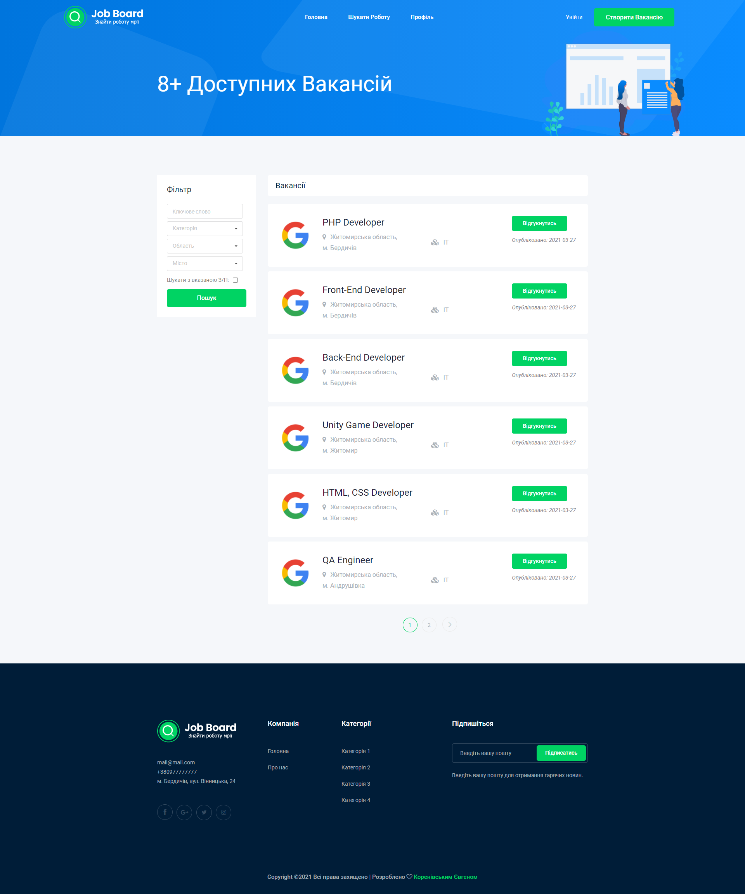
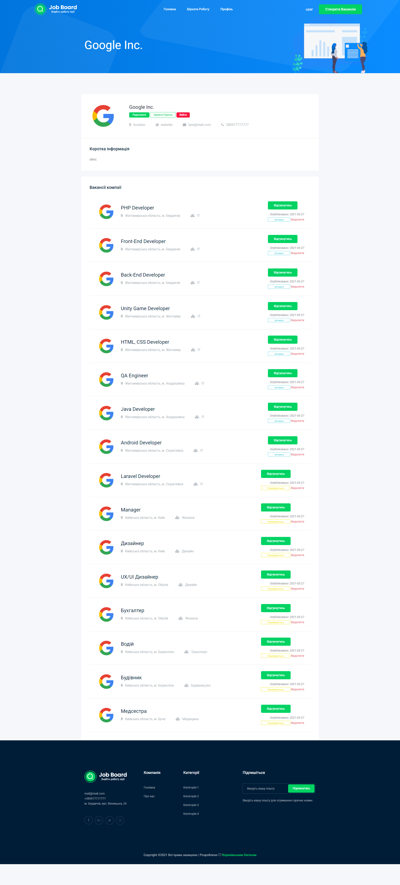
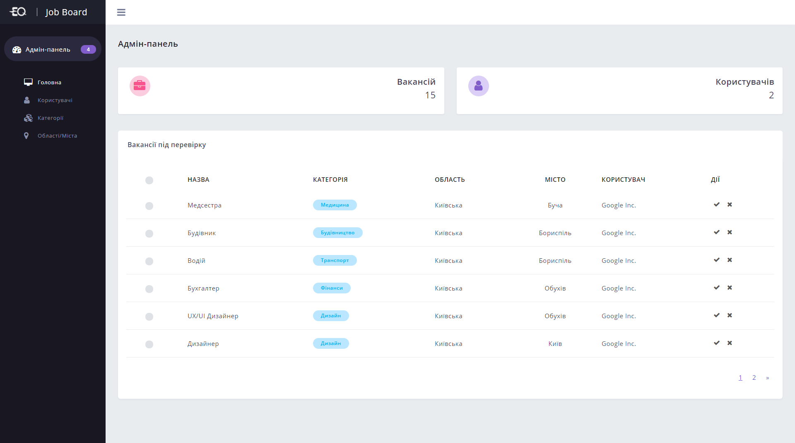
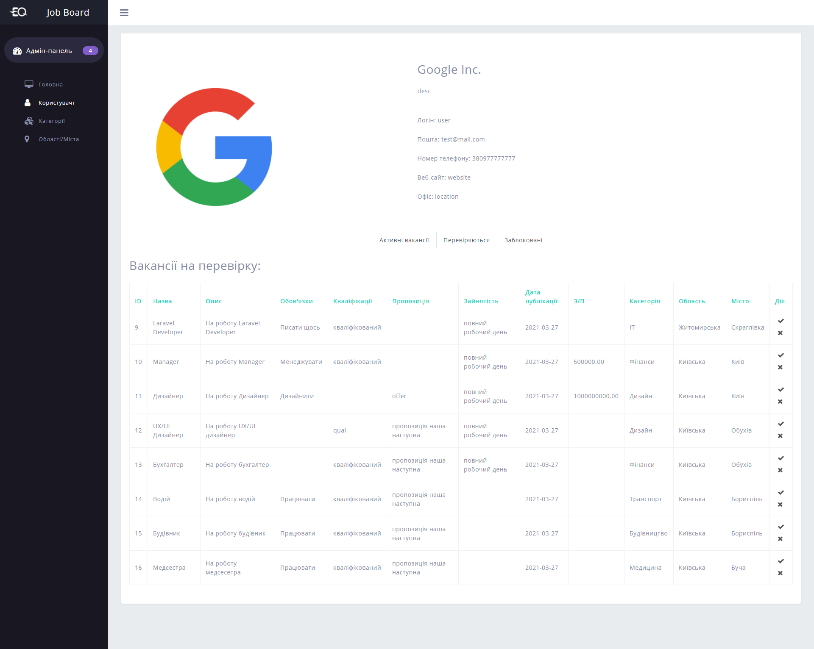
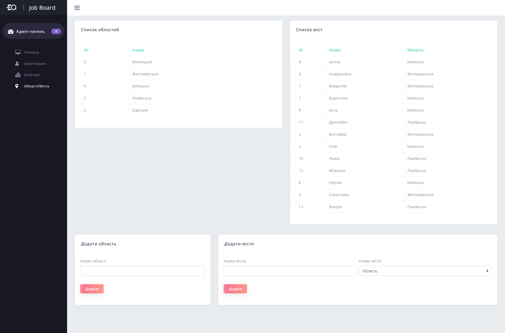

# spring5-advertisment-service
Web service for posting ads<br>

## Getting Started

Advertisement service app is a Spring Boot application built using Maven. You can build a jar file and run it from the command line (JDK 11 is required):

```bash
git clone https://github.com/uniloftsky/spring5-advertisement-service
cd spring5-advertisement-service
./mvnw package
java -jar target/*.jar
```

You can then access app here: [http://localhost:8080](http://localhost:8080)

## Pages view

Index page:<br>

<hr>

Job list page:<br>

<hr>

Profile page:<br>

<hr>

Admin page:<br>

<hr>

Admin page:<br>

<hr>

Admin page:<br>
